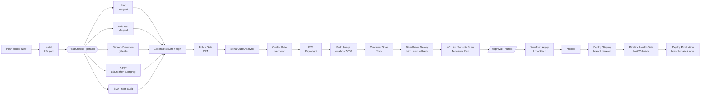
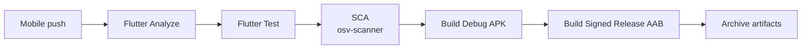
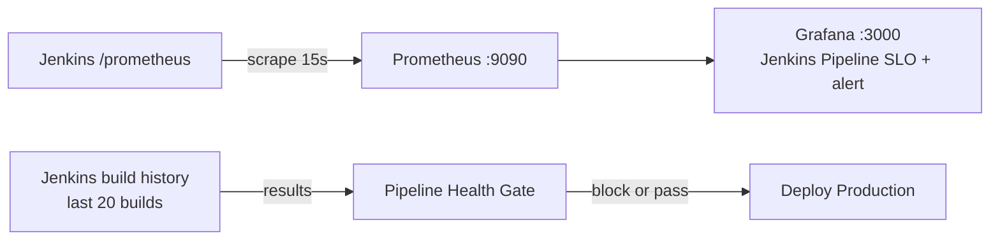

# Taskflow CI/CD Architecture

Everything runs on one Debian host (Docker). Jenkins controller and the `linux-build` agent are containers; the
agent talks to the host Docker daemon through `docker.sock`. Install, Lint and Unit Test run as ephemeral pods on the
`kind` cluster (`k8s-node`); every other stage stays on `linux-build`.

## `taskflow-api` pipeline (`Jenkinsfile`, job `taskflow-pipeline`)

- **Parallel:** only the five Fast Checks lanes. The sequential chains are real dependencies: SBOM -> Policy Gate
  (needs `audit.json` from SCA), Sonar Analysis -> Quality Gate, Plan -> Approval -> Apply, Build Image -> Scan -> Deploy.
- **SAST** runs its two scanners one after the other: Declarative Pipeline rejects a `parallel` nested inside a
  `parallel` (checked with the Jenkins linter).
- **IaC stages** are skipped when the build parameter `SKIP_IAC` is true (test aid, default false).
- **Pipeline Health Gate** blocks `Deploy — Production` when the job's rolling build success rate over its **last 20
  completed builds** is below 90%. The rate comes from the job's own Jenkins build history (SUCCESS = success; FAILURE and
  UNSTABLE = not; ABORTED / running builds are skipped). With fewer than 20 builds it uses what exists and prints
  "N builds available out of 20"; with none it prints an explicit no-data warning (never a fake 100%). It runs on every
  branch; only `main` goes on to deploy.

## `taskflow-mobile` pipeline (Flutter, job `taskflow-mobile-pipeline`)

## Monitoring loop

Components: Jenkins `:8080` (controller), agent `jenkins-agent-linux-build`, `kind` cluster `taskflow`
(Service `taskflow`, Deployments `taskflow-blue` / `taskflow-green`), registry `localhost:5000`, SonarQube `:9000`,
LocalStack `:4566` (Terraform state bucket `taskflow-tfstate`), Prometheus `:9090`, Grafana `:3000`.
